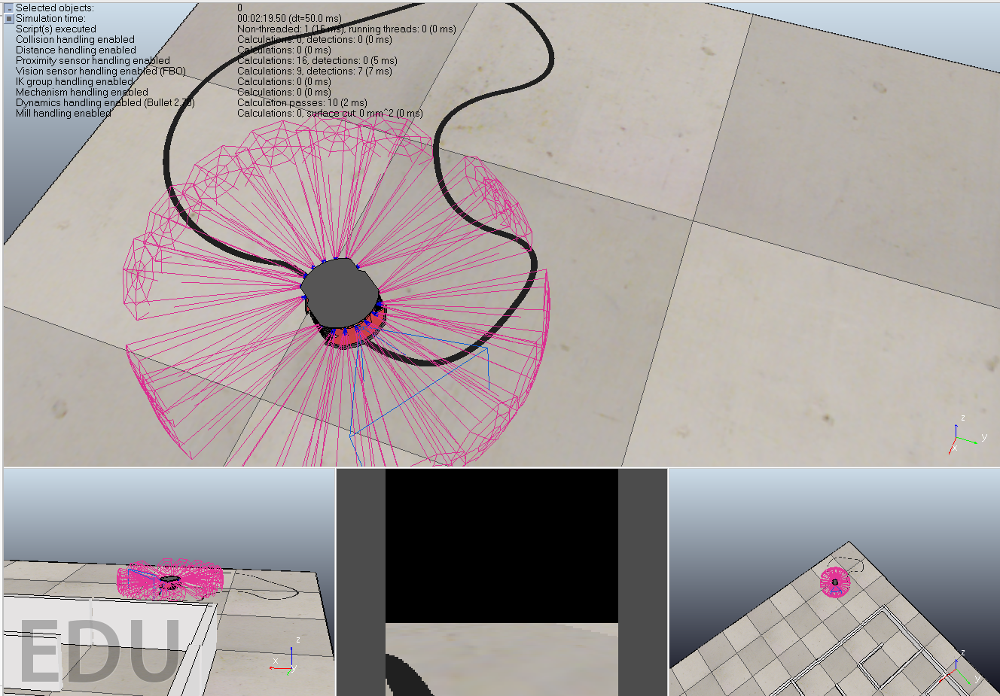
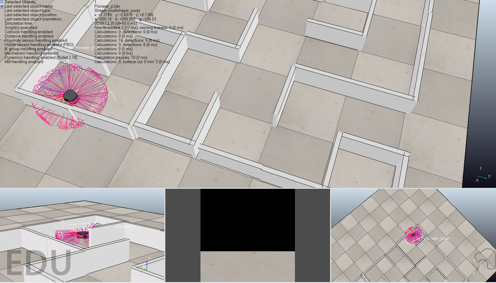

# RL-Car

> THIS PROJECT IS NO LONGER MAINTAINED & MIGHT NOT WORK OUT OF THE BOX.

This project implements OpenAI's gym like interface for V-Rep to train reinforecement learning aggents.

Following two experiments were modeled on the aforementioned environment using Deep Q-Networks (DQN) in Keras,

1. Line follower using infrared (IR) sensors.

2. Obstacle avoidance using proximity sensors.

