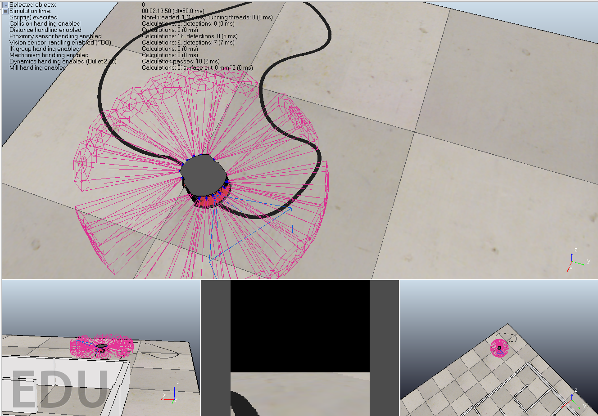
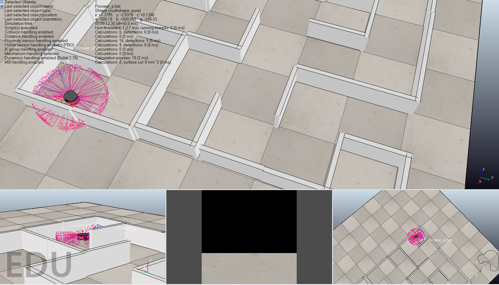

# RL-Car

To train reinforcement learning agents for robotics applications requires access to accurate simulation environment. V-REP is popular robotics simulation environment with wide range of pre-built artifacts available, however, the Python API for V-REP is rusty. This project contains two reference environments which implement OpenAI gym like interface using V-REP.

> Line follower using infrared (IR) sensors.



> Obstacle avoidance using proximity sensors.




## Setting up

### Python

Create a Python 3 virtual environment and install the dependencies.

```
pip install -r requirements.txt
```

### V-REP

First, install V-REP 3.6. Once V-REP is installed, you would need to link V-REP binaries and Python API files.

On MacOS and Linux simply run the following script,

```
bash link_vrep.sh
```

For Windows, copy `remoteApi.dll`, `vrep.py` and `vrepConst.py` files from the V-REP installation folder to `rl_car/vrep`. To make it compatible with Python 3, replace the `from vrepConst` in `vrep.py` with `from .vrepConst`.

## Running Simulation

To run simulation, first start V-REP and load appropriate scene from `rl_car/scenes`. Both IR and proximity sensor examples contain a starter model written with Keras. Start simulation as,

```
# For infrared sensor
python -m rl_car.ir_sensor.train

# For proximity sensor
python -m rl_car.proximity_sensor.train
```